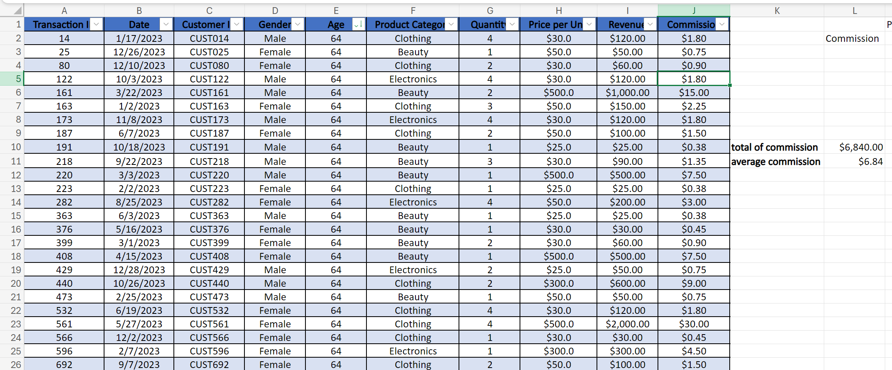
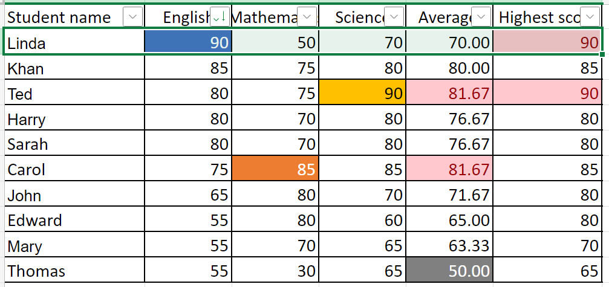
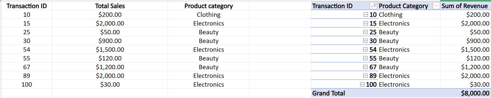
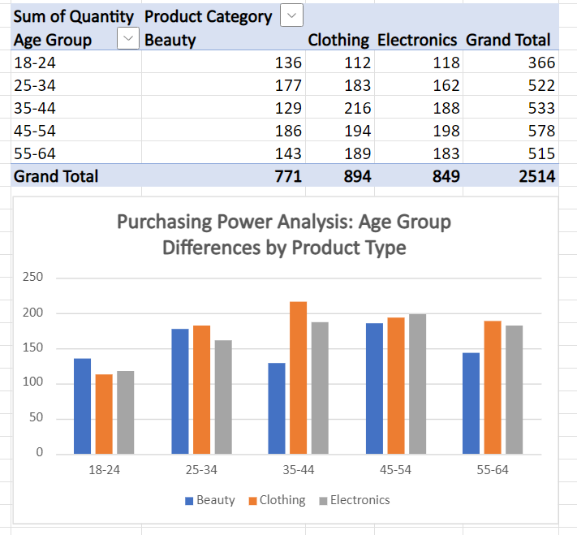
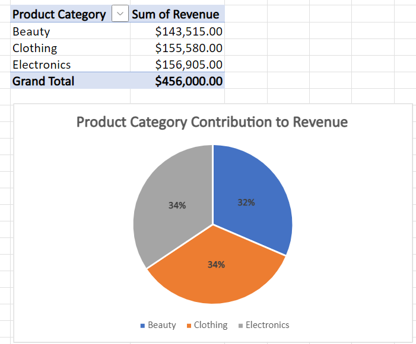
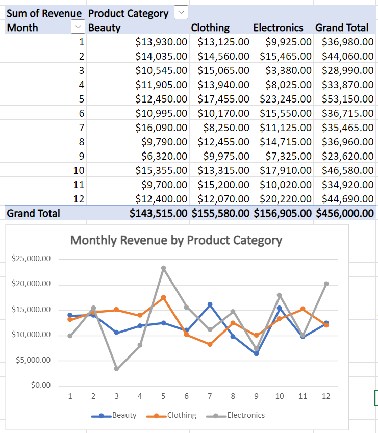

## 📘 Week 1 – WorkBook Summary

This section showcases my core learning outcomes and hands-on work completed during **Week 1** of the **8-week intensive Data Bootcamp** organized by **Just IT**. The tasks focused on foundational data techniques, compliance, Excel analytics, and professional communication.

---

### 🔐 Data Compliance & Governance

Studied key UK data regulations and their real-world applications:

- **Data Protection Act (2018)**
- **GDPR (UK)**
- **Freedom of Information Act (FOIA)**
- **Computer Misuse Act**

> ✅ Explored how each law affects day-to-day data handling, the risks of non-compliance, and practical mitigation measures.

---

### 📊 Excel Data Manipulation & Analysis

Developed key Excel skills, including:

- Table creation & data sorting  
- `SUM`, `AVERAGE`, `VLOOKUP` functions  
- Pivot tables & conditional formatting  
- Dataset exploration & trend analysis

**📷 Example: Retail Dataset Analysis**

**📷 Example: Conditional Formatting on Student Scores**

**📷 Example: Pivot Table Insights**

---

### 🧠 Key Insights from Retail_sales_dataset 

- 💄 **Beauty products** are more frequently purchased by **women**, while **clothing** and **electronics** show no gender bias.
- 👥 **Clothing purchases** peak in the **35–44** or **45–54** age groups, then decline with age.
- 🧓 **Electronics purchases** decrease as age increases beyond middle adulthood.
- ⚖️ Revenue is **evenly distributed** across beauty, clothing, and electronics — no category dominates.
- 📆 **Beauty sales** are stable year-round.
- 👗 **Clothing sales** show a **gradual decline** over the year.
- 📈 **Electronics sales** show a **growth trend**, but with **high monthly volatility**.

**📷 Example: Chart on Age-Based Purchase Trends**

**📷 Example: Chart on Product Category Revenue Distribution**

**📷 Example: Chart on Product Monthly Revenue**

---
### 🛠️ Tools Used

| Tool      | Purpose                                 |
|-----------|------------------------------------------|
| Excel     | Data cleaning, analysis, dashboards      |

---

📌 *This week laid the groundwork for practical data analytics, combining technical skills with business communication and compliance understanding.*

---

