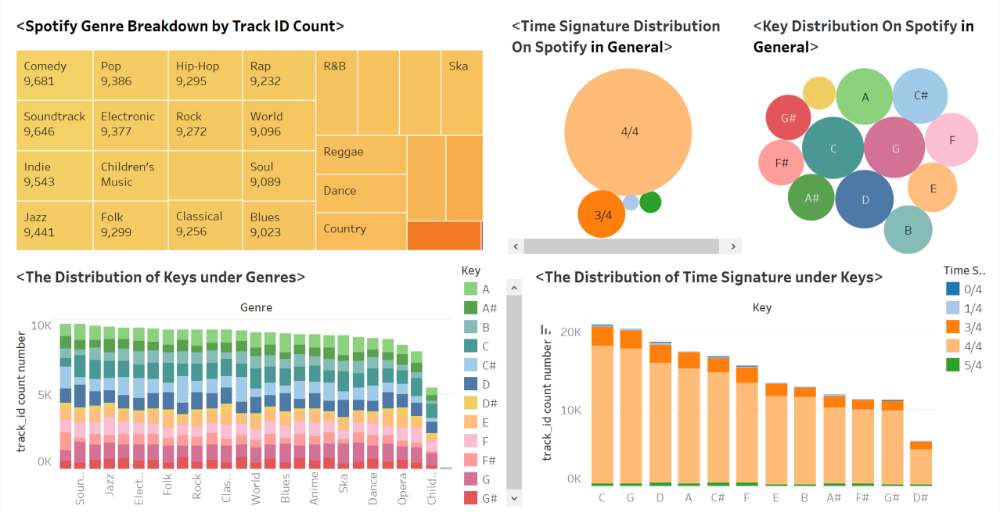
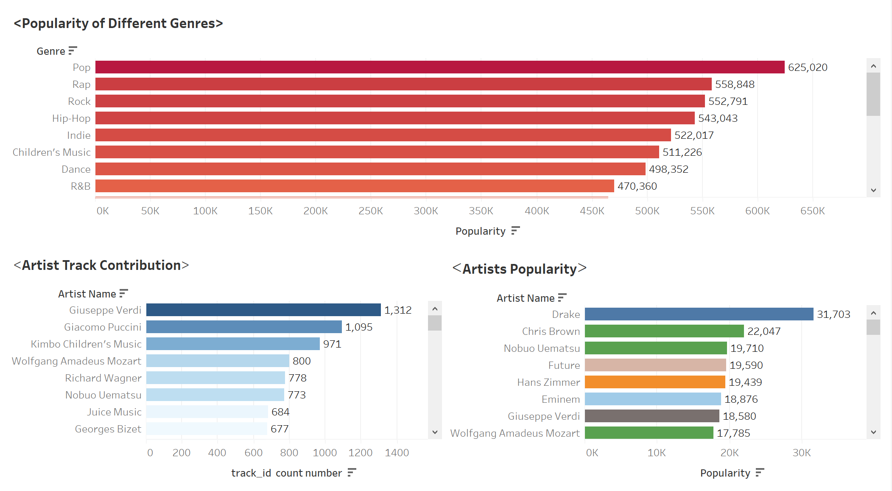
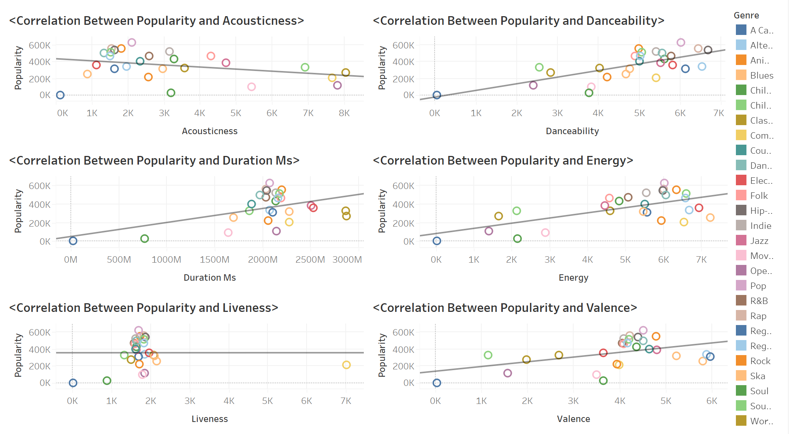
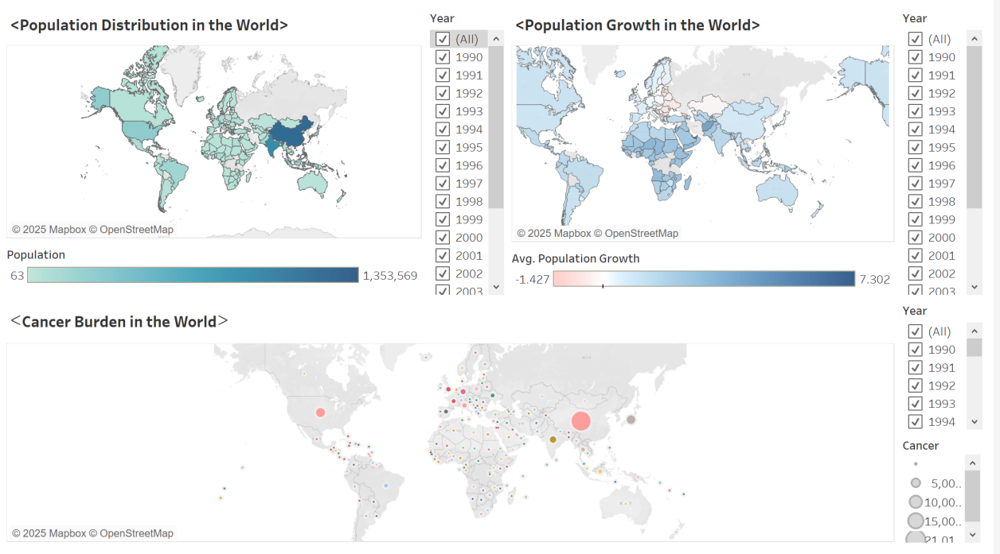
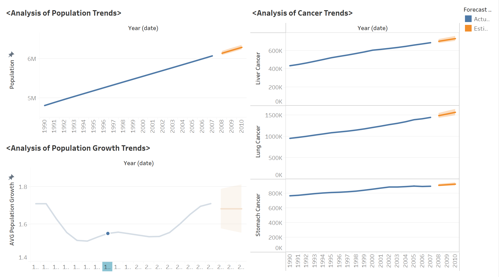
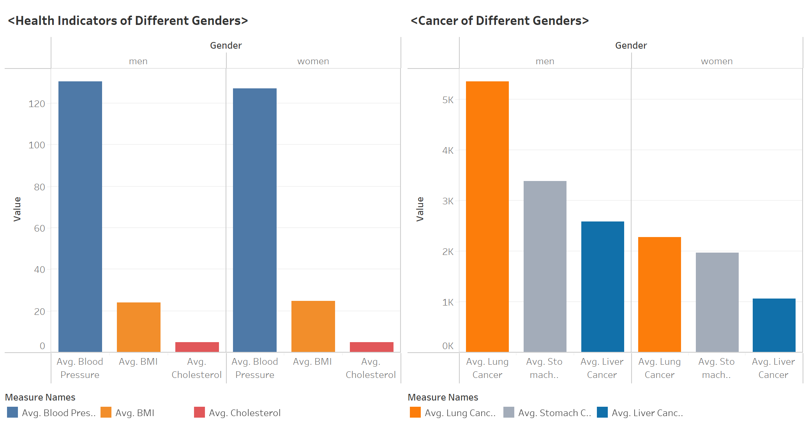
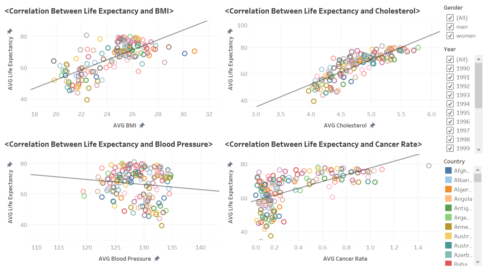

  

## 📘 Week 2 – WorkBook Summary

This section presents my progress and key deliverables from **Week 2** of the **8-week intensive Data Bootcamp** by **Just IT**. This week's focus was on data visualization using Tableau and Power BI, plus real-world data analysis on health, music streaming, and employment.

---

### 📊 Tableau Version Comparison

- Compared **Tableau Public**, **Tableau Desktop**, **Server**, and **Cloud**
- Highlighted feature differences such as:
  - 🔓 **Public visibility limitations** on Tableau Public
  - 🔄 **Refresh scheduling** on paid versions
  - 🔐 **Data privacy** and user access control on enterprise platforms

> ✅ Tableau Public is best suited for learning and public portfolio work, while Desktop, Server, and Cloud support enterprise-level deployment and private analytics.

---

### 📍 Dashboard Project 1: EMSI Job Change UK

- Created a dashboard using EMSI job change data
- Included:
  - 📊 **Bar chart** showing % change in jobs
  - 🗺️ **UK map** showing city-wise impact of job changes

  

---

### 🎧 Dashboard Project 2: Spotify Music Trends

- Built 3 dashboards exploring:
  - 🎼 Music genre distribution
  - 🔥 Most popular artists and genres
  - 📈 Feature correlations with popularity

#### 🔍 Key Findings:
- **Top genres by track count**: Comedy, Soundtrack, Indie, Jazz
- **Most popular genres**: Pop, Rap, Rock
- **Top artist by track count**: Giuseppe Verdi; by popularity: Drake
- **Correlations**:
  - Positive: Danceability, Energy, Valence
  - Negative: Acousticness

  
  
  

---

### 🧬 Dashboard Project 3: Global Health & NHS Support

- Built 4 main dashboards using population and health datasets
- Covered:
  - 🌍 Population distribution and growth trends
  - 🎗️ Global cancer burden and gender disparities
  - 💡 Correlations between life expectancy and health factors

#### 🧠 Insights for NHS:
- Population growth trends can support **resource planning**
- Cancer rates increase with **age and health indicators** (BMI, BP)
- Gender difference in cancer incidence can guide **targeted awareness**
- Life expectancy correlates positively with **BMI, cholesterol, detection rate**

  
  
  
  

---

### 💼 Power BI Virtual Labs: Foundations in Reporting

| Lab #         | Task Description                          | Tool        |
|---------------|--------------------------------------------|-------------|
| Lab 1         | Get data into Power BI                     | Power BI    |
| Lab 2         | Load & transform data                      | Power BI    |
| Lab 6         | Design a report                            | Power BI    |
| Lab 10        | Create an interactive dashboard            | Power BI    |

---

### 🛠️ Tools Used

| Tool       | Purpose                                          |
|------------|--------------------------------------------------|
| Tableau    | Data visualization (job data, Spotify, health)   |
| Power BI   | Reporting labs and dashboard building            |
| Excel      | Dataset prep and summary metrics                 |

---

📌 *This week focused on turning complex datasets into actionable visual insights using Tableau and Power BI — preparing for real-world dashboard reporting and business communication.*
