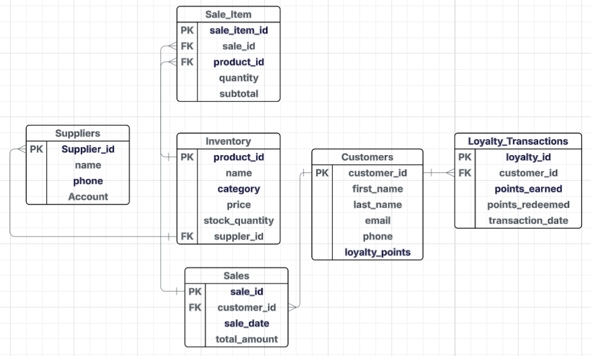

## 📘 Week 3 – WorkBook Summary

This section covers my learning outcomes and practical tasks completed during **Week 3** of the **8-week intensive Data Bootcamp** by **Just IT**. The week focused on database fundamentals, relational vs non-relational systems, SQL joins, database schema design, and practical SQL queries using the world database.

---

### 🧩 Database Concepts & Design

Covered essential concepts for designing and understanding relational databases:

- 🔑 **Primary & Foreign Keys**: Ensure uniqueness and table relationships  
- 📚 **1-to-1, 1-to-many, many-to-many** relationships with real-world examples  
- 🧠 **Relational vs Non-relational DBs**:
  - SQL (e.g., MySQL): Structured, schema-based
  - NoSQL (e.g., MongoDB): Flexible, scalable  
- 🏗️ Designed a schema for a retail business (customers, sales, inventory, loyalty)

> ✅ Gained confidence in choosing the right database model based on use case.

---

### 🔧 SQL JOINs – Use Cases & Syntax

| Join Type     | Use Case Example                                             |
|---------------|--------------------------------------------------------------|
| 🔁 Inner Join  | Customers who made purchases                                 |
| ⬅️ Left Join   | All customers, even those without orders                     |
| ➡️ Right Join  | All products, even those never sold                          |
| 🔄 Full Join   | Combine records from both sides, even unmatched              |
| 🔂 Self Join   | Employee-manager hierarchy from the same table               |
| ❎ Cross Join  | Generate all color-size combinations for a product           |

---

### 🏬 Case Study: Retail Business Database Design

Created a relational schema and SQL structure for a local convenience store:

#### Key Tables:
- `Customers`, `Inventory`, `Sales`, `Sale_Items`, `Suppliers`, `Loyalty_Transactions`

#### Database Schema Design:
<p align="center">
  
</p>

#### Example SQL:
```sql
CREATE TABLE Customers (
  customer_id INT PRIMARY KEY AUTO_INCREMENT,
  first_name VARCHAR(50),
  last_name VARCHAR(50),
  email VARCHAR(100),
  phone VARCHAR(20),
  loyalty_points INT DEFAULT 0
);

INSERT INTO Customers (first_name, last_name, email, phone)
VALUES ('Sean', 'Chen', 'Sean@example.com', '444-1234');
```
---

### 🧪 SQL Practical: World Database Challenges

Ran real-world SQL queries using `world_db`. Key examples include:

---

####  Count US Cities
```sql
SELECT count(Name)
FROM city
WHERE CountryCode = "USA";
```

####  Country with Highest Life Expectancy
```sql
SELECT Name, LifeExpectancy
FROM country
WHERE LifeExpectancy = (
  SELECT MAX(LifeExpectancy)
  FROM country
);
```

####  Top 10 Most Populous Cities
```sql
SELECT Name, Population
FROM city
ORDER BY Population DESC
LIMIT 10;
```
####  Cities with 'New' in the Name
```sql
SELECT Name
FROM city
WHERE Name LIKE "%New%";
```

####  GDP Per Capita (Above Average)
```sql
SELECT city.Name, A.GDP, A.AVG_GDP
FROM (
  SELECT Name, capital, (GNP/Population) AS GDP,
         (SELECT AVG(GNP/Population) FROM country) AS AVG_GDP
  FROM country
  WHERE (GNP/Population) > (SELECT AVG(GNP/Population) FROM country)
) AS A
LEFT JOIN city
ON A.Capital = city.ID
ORDER BY A.GDP DESC;
```

---
### 🛠️ Tools Used

| Tool       | Purpose                                          |
|------------|--------------------------------------------------|
| MySQL      | SQL querying & database logic   |
| MySQL Workbench   | Writing & testing queries     |
| ERD tools      | Schema visualization             |

---

📌 *Week 3 reinforced practical SQL logic and back-end data design skills, essential for any data-driven role.*


