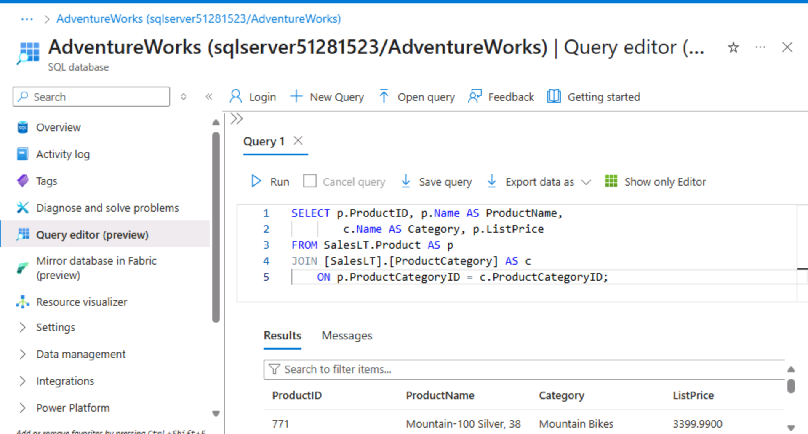
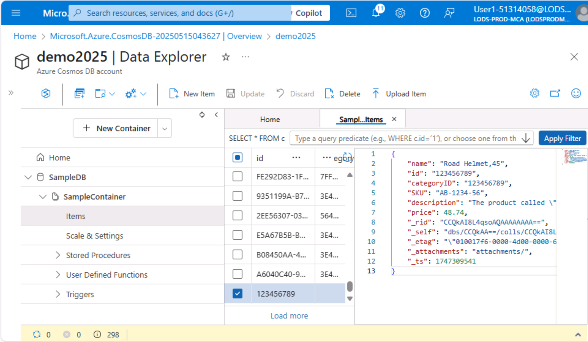
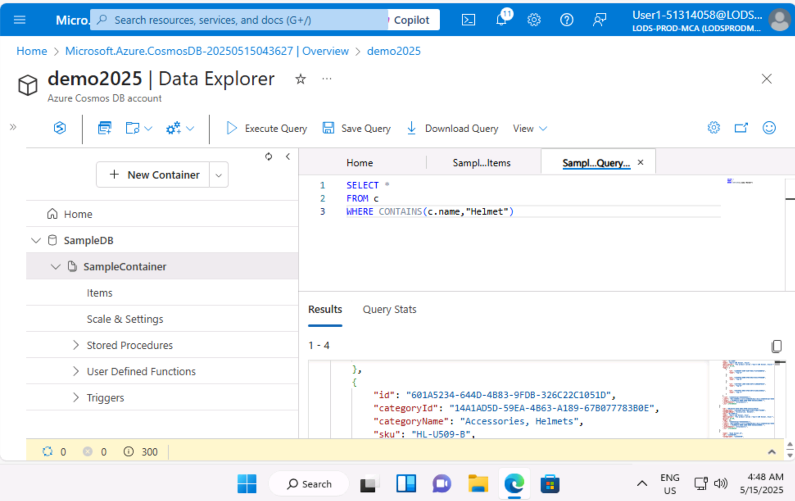
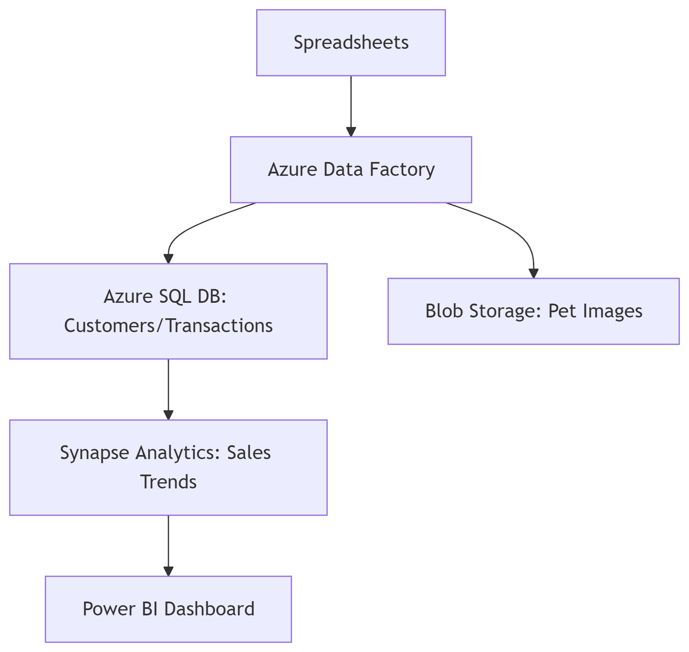

# 📘 Week 5 – WorkBook Summary  

This document summarizes key learnings and hands-on activities from **Week 5** of the **8-week intensive Data Bootcamp** by **Just IT**, focusing on cloud computing, Azure services, data regulations, and a business case study.  

---

## ☁️ **Cloud Computing Fundamentals**  
Explored core concepts and real-world applications:  

### **Cloud Models**  
| Type          | Use Case Example                          |  
|---------------|-------------------------------------------|  
| Public Cloud  | Startup hosting a scalable mobile app (AWS/Azure) |  
| Private Cloud | Bank storing confidential client data     |  
| Hybrid Cloud  | Retailer using public cloud for sales spikes + private for CRM |  
| Community Cloud | Government agencies sharing regional service data |  

### **Service Types**  
- **IaaS**: Hosted virtual machines (e.g., AWS EC2 for testing environments).  
- **PaaS**: Developer tools (e.g., Azure App Services for building APIs).  
- **SaaS**: Ready-to-use software (e.g., Microsoft 365 for collaboration).  

> ✅ **Key Insight**: Cloud reduces hardware costs by 40-60% while improving scalability (AWS case studies).  

---

## ⚖️ **Data Laws & Regulations**  
### **1. Computer Misuse Act (1990)**  
- Criminalizes:  
  - Unauthorized access (e.g., using colleague’s login).  
  - Intentional data modification (e.g., deleting sales records).  

### **2. Police and Justice Act (2006) Amendments**  
- Added offenses:  
  - DoS attacks (e.g., crashing a retailer’s website).  
  - Creating/distributing hacking tools.  

### **3. GDPR & DPA 2018 Compliance**  
- **Paws & Whiskers** must:  
  - Obtain consent for storing customer addresses/purchase history.  
  - Implement Azure encryption for payment data (PCI DSS).  

---

## 🔧 **Azure Hands-On Labs**  
### **1. Relational Data (Azure SQL)**  
- Set up and queried SQL databases.
- Evidence: Screenshots of configured tables and queries.

  

### **2. Non-Relational Data**  
- Worked with Azure Blob Storage and Cosmos DB.
- Evidence: Screenshots of data uploads and NoSQL operations.

  
  

---

## 🐾 Case Study: "Paws & Whiskers" Azure Proposal
Designed a cloud solution for a pet shop transitioning to Azure:

**Compliance:** Addressed GDPR and DPA 2018 for customer data.

**Azure Services:**

 - Storage: Azure SQL Database (structured data), Blob Storage (unstructured).

 - Analytics: Synapse Analytics (sales trends), Machine Learning (customer behavior).

 - Automation: Data Factory for pipeline integration.

 - Data Modeling: Relational tables for customers, transactions, and inventory.

  

---

## 📜 Key Takeaways
- **Cloud Adoption:** Azure’s flexibility supports business growth while ensuring compliance.

- **Legal Awareness:** Understanding laws like GDPR is critical for data-driven businesses.

- **Practical Skills:** Gained experience with Azure’s core services through labs.

---

## 🛠️ Tools & Services Used
| Tool/Service       | Purpose                                  |
|--------------------|------------------------------------------|
| Azure SQL Database | Relational data storage and management   |
| Azure Blob Storage | Unstructured data storage                |
| Azure Synapse      | Large-scale data analytics               |

---

📌 Week 5 deepened my understanding of cloud infrastructure, Azure’s ecosystem, and the intersection of data management with legal compliance.
