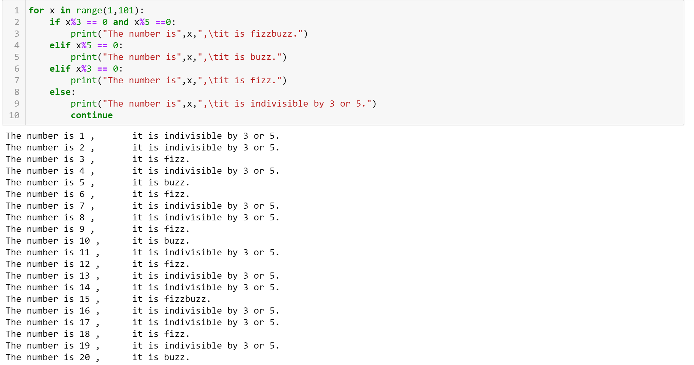
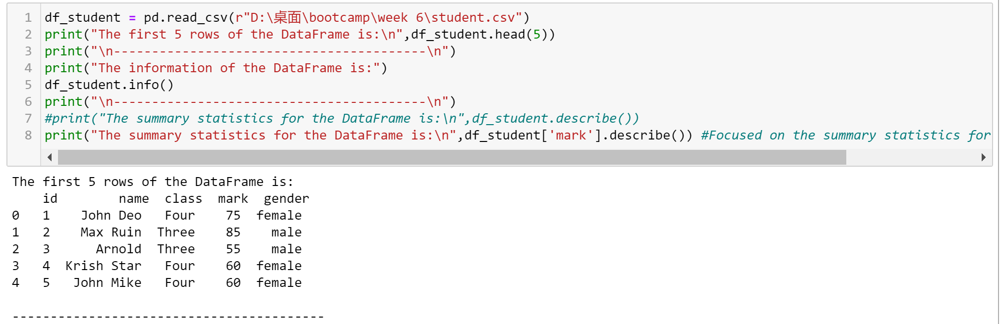
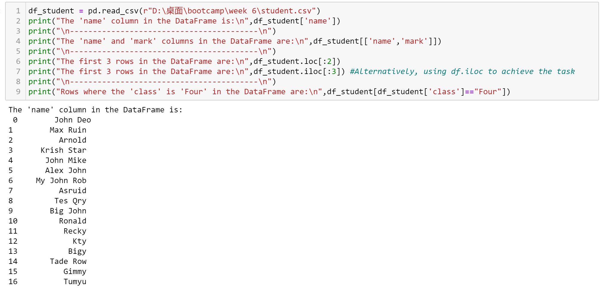
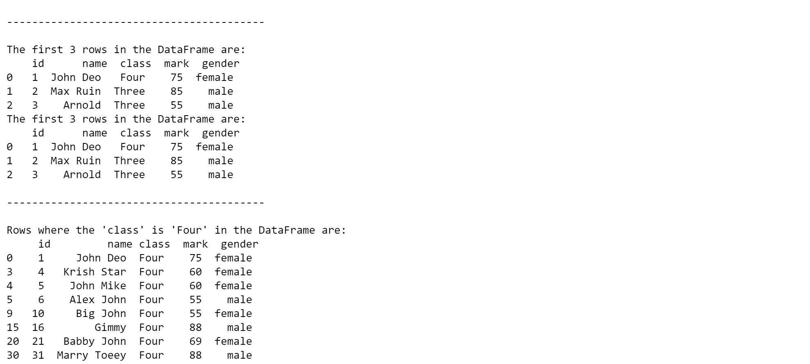
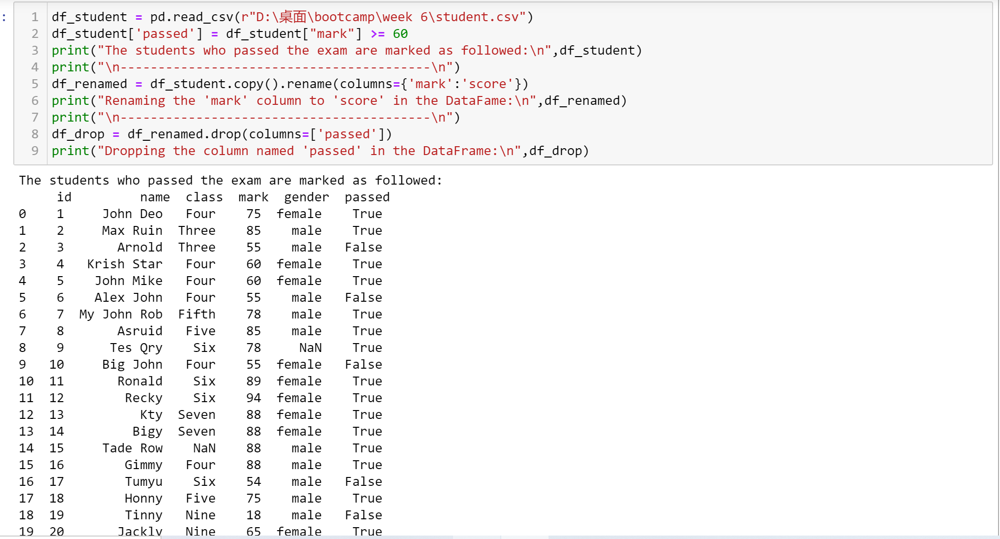
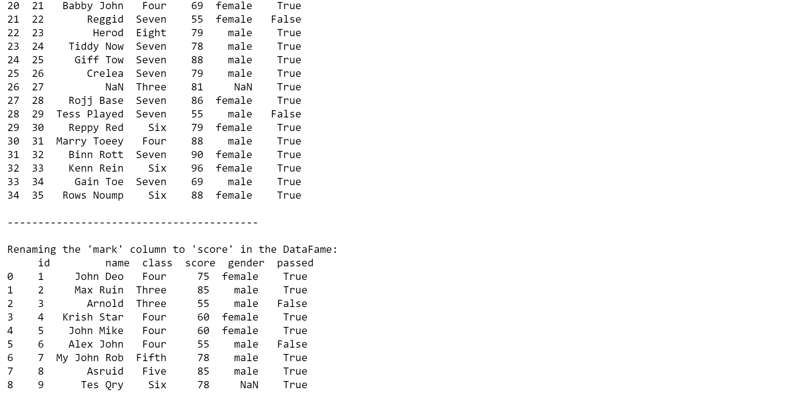
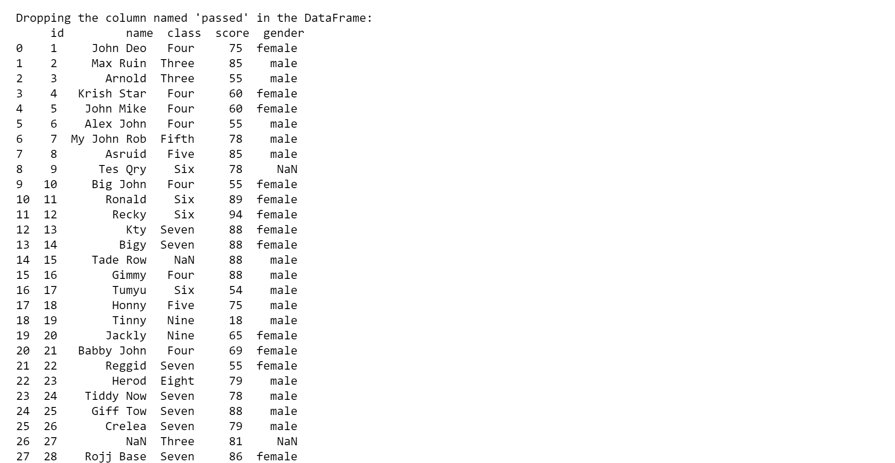

# 📘 Week 6 – WorkBook Summary  

This document summarizes Python data manipulation skills and practical exercises completed during **Week 6** of the **8-week intensive Data Bootcamp** by **Just IT**, focusing on Pandas operations, data analysis, and visualization.

---

## 🐍 **Python Fundamentals: FizzBuzz Challenge**
Implemented the classic programming interview question:

```python
for num in range(1, 101):
    if num % 15 == 0:
        print("fizzbuzz")
    elif num % 3 == 0:
        print("fizz")
    elif num % 5 == 0:
        print("buzz")
    else:
        print(num)
```
<p float="center">
  
</p>
---

## 📊 Pandas Data Analysis: Student Dataset
- **Exercise 1: Loading and Exploring Data**

```python
import pandas as pd
df = pd.read_csv('student.csv')  # Load CSV
df.head(5)                       # First 5 rows
df.info()                        # DataFrame structure
df.describe()                    # Summary statistics
```
<p float="center">
  
  
</p>

- **Exercise 2: Indexing and Slicing**
```python
df['name']                        # Single column
df[['name', 'mark']]              # Multiple columns
df.iloc[:3]                       # First 3 rows
df[df['class'] == 'Four']         # Filter by class
```
<p float="center">
  
  
</p>

- **Exercise 3: Data Manipulation**
```python
df['passed'] = df['mark'] >= 60    # New boolean column
df.rename(columns={'mark':'score'}) # Rename column
df.drop('passed', axis=1)           # Remove column
```
<p float="center">
  
  
  
</p>

- **Exercise 4: Aggregation**
```python
df.groupby('class')['mark'].mean()  # Avg mark per class
df['class'].value_counts()          # Students per class
df.groupby('gender')['mark'].mean() # Gender performance
```
Aggregation Results

- **Exercise 5: Advanced Operations**
```python
# Pivot Table
pd.pivot_table(df, index='class', columns='gender', values='mark')

# Grade Categorization
df['grade'] = pd.cut(df['mark'], 
                     bins=[0, 60, 70, 85, 100], 
                     labels=['D', 'C', 'B', 'A'])

# Sorting
df.sort_values('mark', ascending=False)
```
Advanced Operations

- **Exercise 6/7: Export & Visualization**
```python
df.to_csv('graded_students.csv')   # Export
df.plot(kind='bar', x='name', y='mark')  # Visualization
Visualization
```
