# 📘 Week 6 – WorkBook Summary  

This document summarizes Python data manipulation skills and practical exercises completed during **Week 6** of the **8-week intensive Data Bootcamp** by **Just IT**, focusing on Pandas operations, data analysis, and visualization.

---

## 🐍 **Python Fundamentals: FizzBuzz Challenge**
Implemented the classic programming interview question:

```python
for num in range(1, 101):
    if num % 15 == 0:
        print("fizzbuzz")
    elif num % 3 == 0:
        print("fizz")
    elif num % 5 == 0:
        print("buzz")
    else:
        print(num)
```
<p float="center">
  
</p>

---

## 📊 Pandas Data Analysis: Student Dataset
### Exercise 1: Loading and Exploring Data

```python
import pandas as pd
df = pd.read_csv('student.csv')  # Load CSV
df.head(5)                       # First 5 rows
df.info()                        # DataFrame structure
df.describe()                    # Summary statistics
```
<p float="center" style="vertical-align: top;">
  
  
</p>

### Exercise 2: Indexing and Slicing
```python
df['name']                        # Single column
df[['name', 'mark']]              # Multiple columns
df.iloc[:3]                       # First 3 rows
df[df['class'] == 'Four']         # Filter by class
```
<p float="center" style="vertical-align: top;">
  
  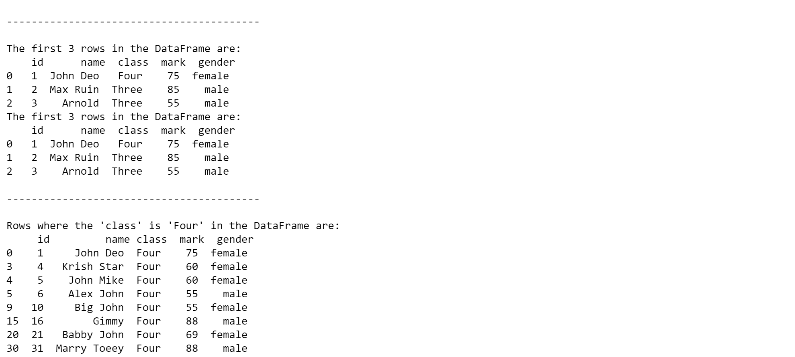
</p>

### Exercise 3: Data Manipulation
```python
df['passed'] = df['mark'] >= 60    # New boolean column
df.rename(columns={'mark':'score'}) # Rename column
df.drop('passed', axis=1)           # Remove column
```
<p float="center" style="vertical-align: top;">
  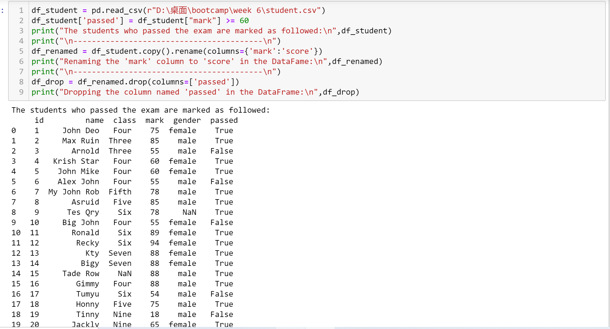
  
  
</p>

### Exercise 4: Aggregation
```python
df.groupby('class')['mark'].mean()  # Avg mark per class
df['class'].value_counts()          # Students per class
df.groupby('gender')['mark'].mean() # Gender performance
```
<p float="center">
  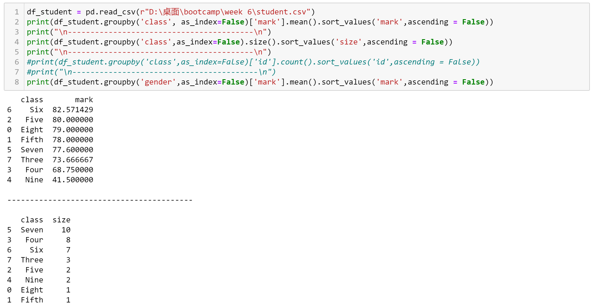
</p>

### Exercise 5: Advanced Operations
```python
# Pivot Table
pd.pivot_table(df, index='class', columns='gender', values='mark')

# Grade Categorization
df['grade'] = pd.cut(df['mark'], 
                     bins=[0, 60, 70, 85, 100], 
                     labels=['D', 'C', 'B', 'A'])

# Sorting
df.sort_values('mark', ascending=False)
```
<p float="center" style="vertical-align: top;">
  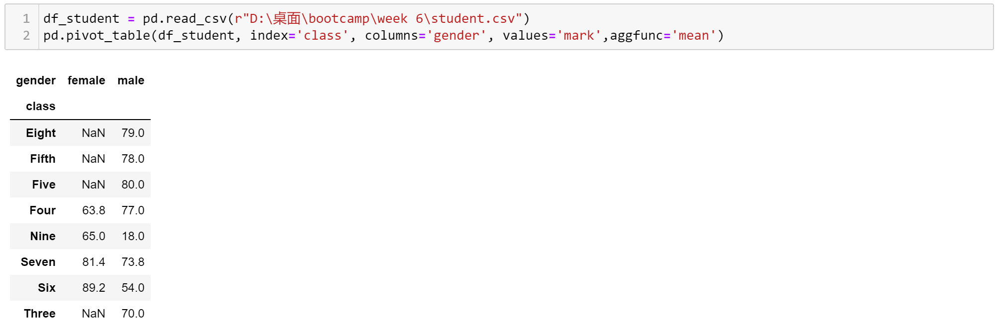
  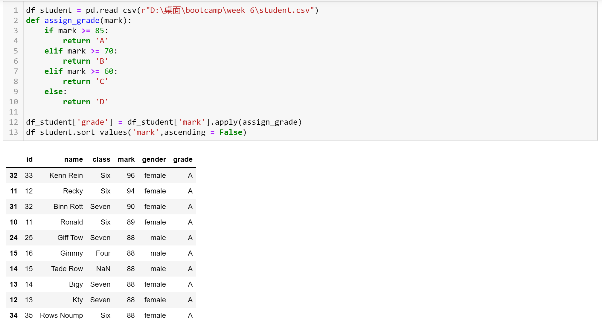
</p>

### Exercise 6/7: Export & Visualization
```python
df.to_csv('graded_students.csv')   # Export
df.plot(kind='bar', x='name', y='mark')  # Visualization
```
<p float="center" style="vertical-align: top;">
  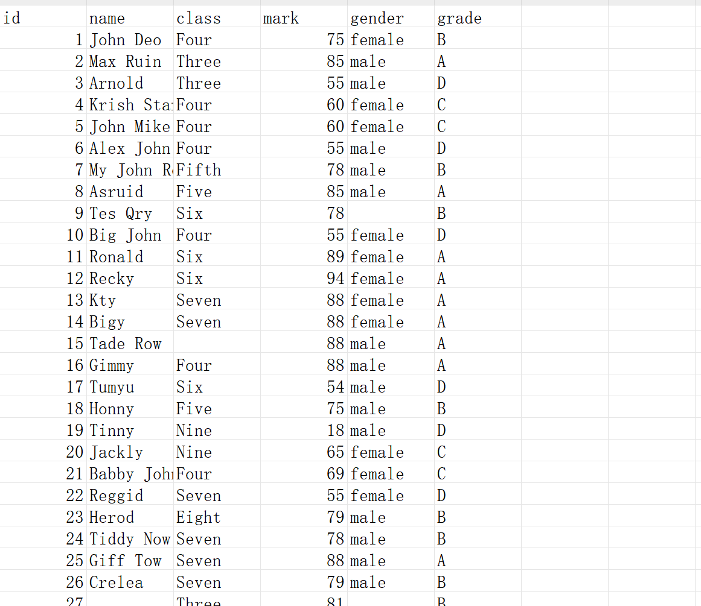
  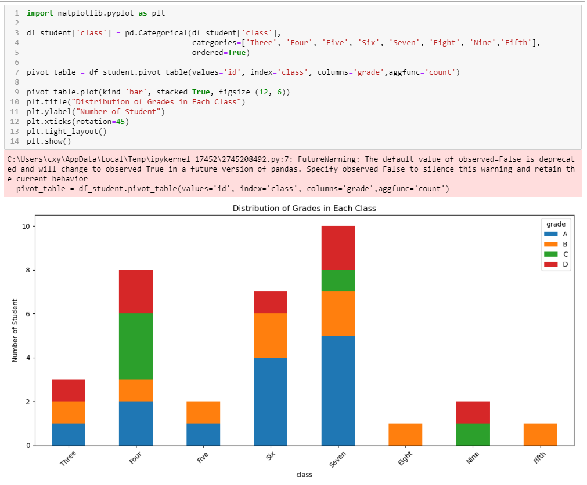
</p>

---

## 🌍 GDP Data Analysis
**A comparison of living standards across countries and regions based on GDP-related data from three major sources: the World Bank, the IMF, and UN Data.**

### 🔹 Example 1: Data Inspection & Cleansing
<p float="left" style="vertical-align: top;">
  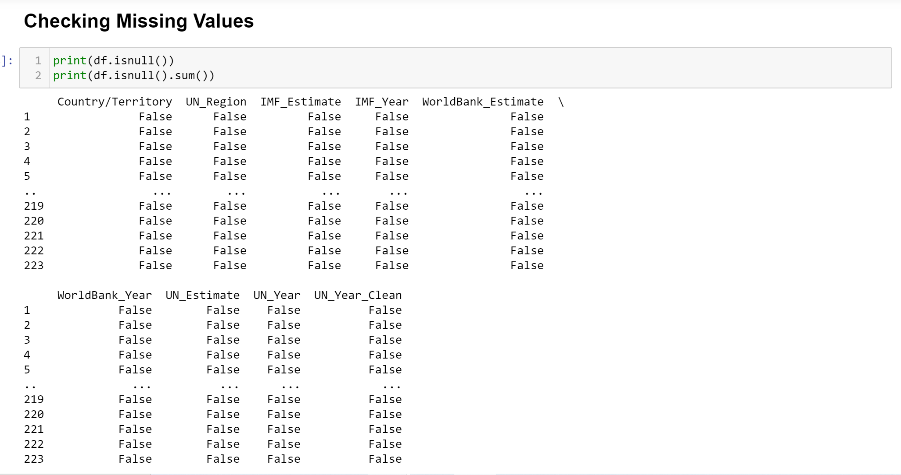
  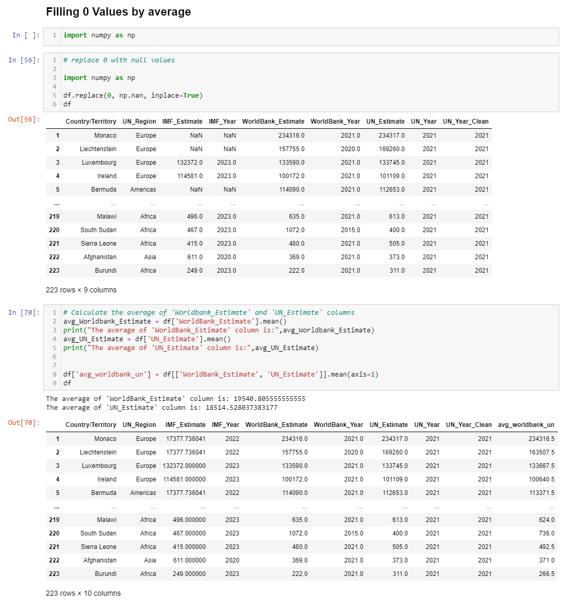
</p>

### 🔹 Example 2: Correlation Heatmap
<p float="center" style="vertical-align: top;">
  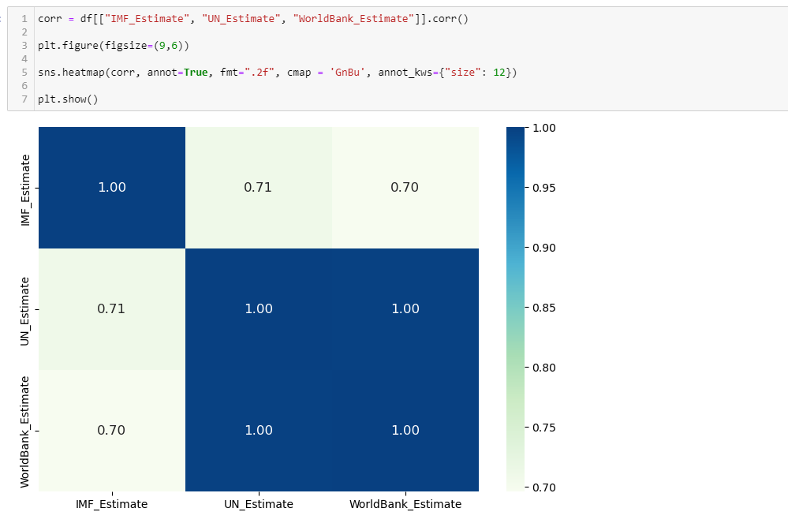
</p>

### 🔹 Example 3: Bar Plot
<p float="center" style="vertical-align: top;">
  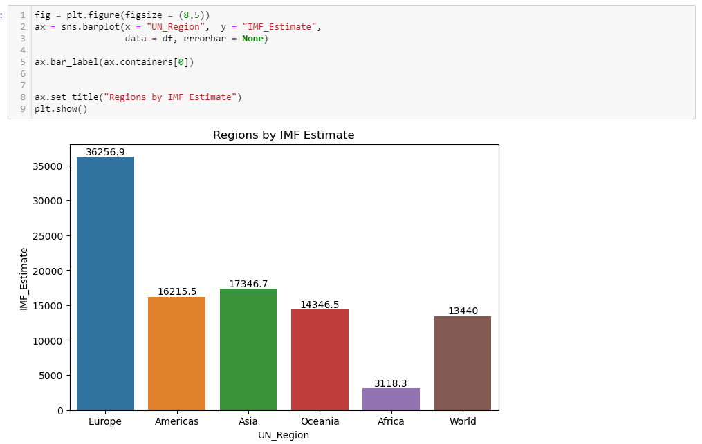
</p>

### 🔹 Example 4: Scatter Plot
<p float="center" style="vertical-align: top;">
  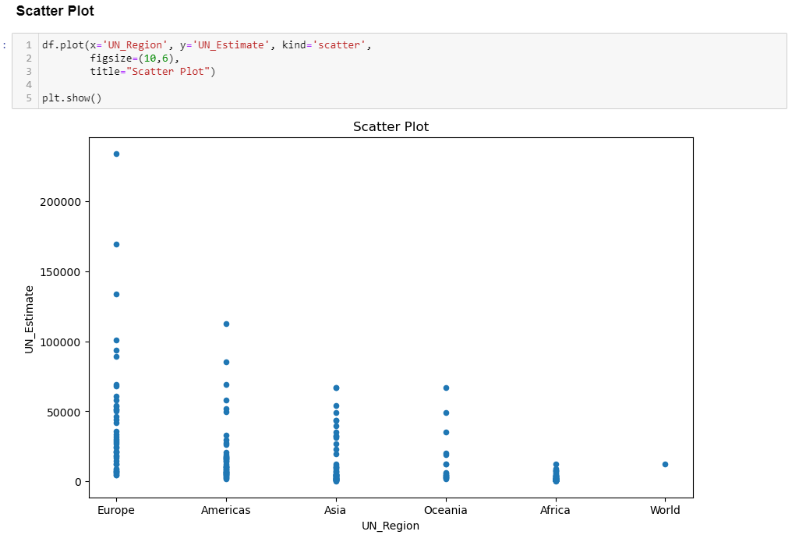
</p>

---

## 🔑 Key Takeaways
- **Pandas Proficiency:** Mastered DataFrame operations (filtering, grouping, pivoting)

- **Data Pipelines:** Built end-to-end workflow from loading → analysis → visualization

- **Real-World Application:** Applied skills to both educational (student) and economic (GDP) datasets

---

## 🛠️ Tools Used
| Tool      | Purpose                                 |
|-----------|------------------------------------------|
| Pandas    | Data manipulation and analysis           |
| Jupyter   | Interactive coding environment           |
| Matplotlib| Basic data visualization                 |
| Seaborn   | Statistical data visualization           |
| Plotly    | Interactive, web-based visualizations    |

---

📌 Week 6 solidified my Python data wrangling skills with Pandas, from basic operations to advanced analytics, while applying these techniques to real-world datasets (student performance and GDP analysis). The hands-on exercises strengthened my ability to transform raw data into actionable insights through cleaning, visualization, and statistical aggregation.
